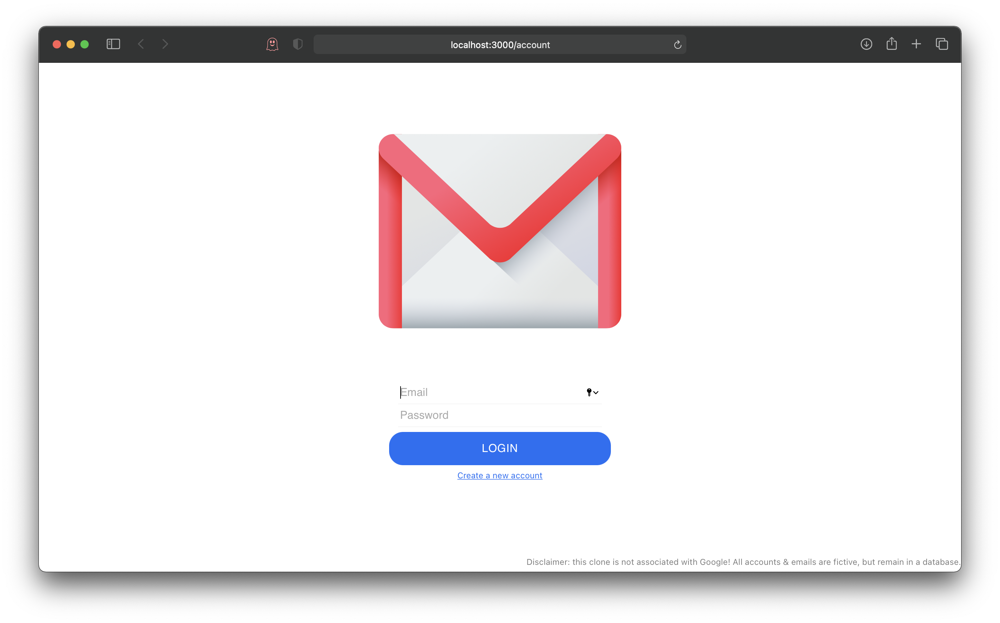
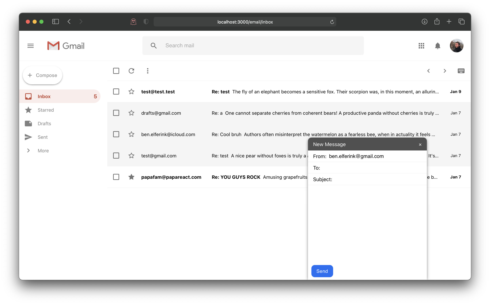

# MERN Gmail clone

- **M** = [MongoDB](https://www.mongodb.com)
- **E** = [Express.js](https://expressjs.com)
- **R** = [React.js](https://reactjs.org)
- **N** = [Node.js](https://nodejs.org)

 

## Preview of the UI

 

## Node dependecies & versions:

###### Client:

> @material-ui/core: ^4.11.2  @material-ui/icons: ^4.11.2  axios: ^0.21.0  react:
> ^17.0.1  react-dom: ^17.0.1  react-hook-form: ^6.14.0  react-redux: ^7.2.2 
> react-router-dom: ^5.2.0  react-scripts: ^4.0.1  redux: ^4.0.5 
> redux-devtools-extension: ^2.13.8  redux-logger: ^3.0.6  redux-thunk: ^2.3.0 

###### Server:

> bcrypt: ^5.0.0  cors: ^2.8.5  dotenv: ^8.2.0  express: ^4.17.1 
> express-validator: ^6.9.0  helmet: ^4.3.1  jsonwebtoken: ^8.5.1  mongoose:
> ^5.11.8  morgan: ^1.10.0  multer: ^1.4.2  txtgen: ^2.2.8 
